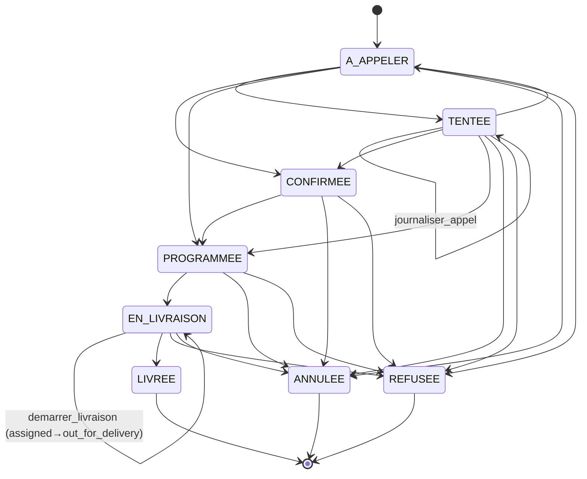
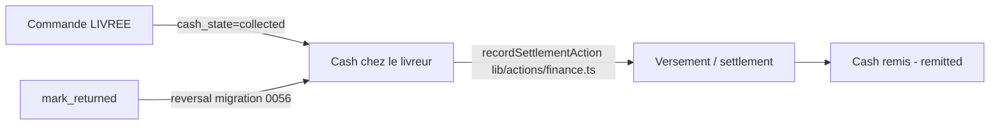
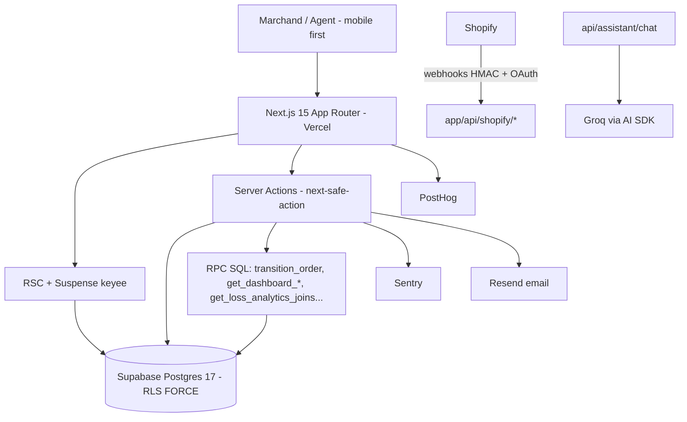
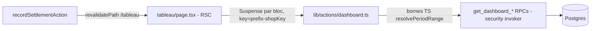

# Tëër — Project Audit & Product/Technical Specification

> Date de l'audit : 2026-07-03 · Branche auditée : `main` (HEAD `4a7828a`)
> Dernière migration appliquée : `0082` (cf. `CLAUDE.md`)
>
> **Statut des affirmations** — chaque affirmation de ce document est étiquetée implicitement :
> - **[Confirmé]** : vérifié dans le code, avec chemin de fichier.
> - **[Hypothèse]** : déduction raisonnable non vérifiée ligne à ligne.
> - **[Recommandation]** : proposition, pas un état de fait.
> - **[Risque]** : danger identifié, à traiter ou surveiller.
> - `À confirmer` : information non vérifiable dans le repo au moment de l'audit.
>
> Ce document est un **audit + spécification de référence**. Il ne remplace pas `CLAUDE.md`
> (règles opérationnelles pour agents) : en cas de divergence sur une règle d'ingénierie,
> **`CLAUDE.md` fait foi**. Ce document, plus long, sert à comprendre le produit, l'architecture
> et les risques.

---

## 1. Executive Summary

**Tëër est un SaaS de gestion d'opérations COD (Cash On Delivery) pour marchands e-commerce
d'Afrique de l'Ouest** (monnaie FCFA, téléphonie sénégalaise — cf. `lib/address/phone-sn.ts`,
`lib/format/fcfa.ts`, timezone E2E `Africa/Dakar` dans `playwright.config.ts:61`). Le cœur du
produit : centraliser les commandes (manuelles + Shopify), piloter le cycle appel → confirmation →
livraison → encaissement cash, suivre le cash détenu par les livreurs, et fournir tableau de bord,
analyses de pertes et finances.

**Stack** [Confirmé, `package.json`] : Next.js 15 App Router + React 19 + TypeScript 5.7,
Tailwind CSS 4, Supabase (Postgres 17, RLS forcée, 82 migrations), `next-safe-action` v8 pour
toutes les mutations, `next-intl` (fr), Recharts 3, Vaul + Radix (overlays), nuqs (état URL),
Sentry, PostHog, Resend, Upstash (rate-limit), AI SDK v6 + Groq (assistant IA), Biome
(lint/format), Vitest (unit + RLS), Playwright (E2E + visual, 3 projets : chromium / pixel-7 /
iphone-14). Déploiement : Vercel (`vercel.json`) + Supabase hébergé. Intégration Shopify complète
(OAuth, webhooks HMAC, sync commandes/produits, GDPR — `lib/shopify/`, `shopify.app.toml`).

**Points forts** : machine à états commande à 4 dimensions avec write-gate unique
(`transition_order` RPC), discipline RLS deny-by-default multi-tenant, suite de tests large
(≈106 fichiers de tests dont 20 specs RLS), gotchas documentés avec preuves dans `CLAUDE.md`.

**Risques principaux** (détail §15) : (1) le plafond silencieux PostgREST `max_rows=1000` a déjà
produit 3 séries de chiffres faux et peut réapparaître sur tout nouveau `.select()` agrégé en JS ;
(2) les fonctions `SECURITY DEFINER` avec garde de rôle non NULL-safe ont déjà causé une fuite
cross-tenant potentielle (migrations `0042`/`0043`) ; (3) le Router Cache client de Next en build
prod rend périmée toute donnée serveur relue par navigation (« Paradigm A » obligatoire) ;
(4) la dérive schéma local vs prod après `db push` casse silencieusement les tests locaux.

---

## 2. Product Overview

### 2.1 Proposition de valeur

Tëër remplace le pilotage WhatsApp/cahier des marchands COD par un cockpit unique :
- **File d'appels** : chaque nouvelle commande est « À appeler » ; l'agent appelle, journalise,
  confirme, programme ou annule (`components/orders/call-log-dialog.tsx`,
  `lib/orders/call-log-validation.ts`).
- **Livraison** : assignation à un livreur, démarrage, livraison/échec/retour, avec mouvement de
  stock atomique (`lib/actions/transitions.ts`, RPC `transition_order`).
- **Cash** : le montant à encaisser (`cash_collectable_minor`) suit la commande ; le cash collecté
  s'accumule « chez le livreur » jusqu'au versement (`lib/drivers/cash-consolidation.ts`,
  `lib/finance/driver-settlements.ts`, RPC de règlement migration `0018`).
- **Visibilité** : Tableau (KPI, priorités, CA), Analyses (pertes, refus, zones, livreurs),
  Finances (marge, coûts produits/livreurs, dépenses, rapport PDF `app/api/rapport/route.tsx`).

### 2.2 Périmètre fonctionnel actuel [Confirmé par les routes `app/(app)/*`]

| Module | Route | Contenu |
|---|---|---|
| Tableau de bord | `/tableau` | KPI, priorités, CA 30j, top produits, perf boutique, répartition COD, activité, essentiels ops |
| Commandes | `/commandes` (+ `/commandes/[id]` + modal interceptée `@modal/(.)[id]`) | Liste vues sauvegardées, recherche, kanban, création manuelle, transitions |
| Clients | `/clients` | Fiabilité client (`lib/customers/reliability.ts`), enrichissement Shopify |
| Produits | `/produits` | Catalogue, stock, coût unitaire (CUMP — `tests/unit/stock/cump.test.ts`) |
| Livreurs | `/livreurs` | Perf livreur, stock avancé (lots), cash en main, versements |
| Finances | `/finances` | KPI finance, profit, coûts produit/livreur, dépenses, versements, rapport PDF |
| Analyses | `/analyses` | Loss analytics : annulations, refus, RTO, zones, raisons, refuseurs récidivistes |
| Boutiques | `/boutiques` | Connexion Shopify multi-boutique, sync |
| Aide (« assistant ») | `/assistant` | FAQ 50 entrées + assistant IA (AI SDK + Groq) + feedback |
| Paramètres | `/parametres` | Profil, équipe/invitations, boutiques, sécurité (MDP, email, idle timeout) |
| Auth | `/connexion`, `/onboarding`, `/invitation/accept`, `/reacceptation` | Split-screen BrandPanel, onboarding progressif, mur de consentement légal |
| Marketing | `/` (`app/(marketing)/page.tsx`) + pages légales (`/conditions`, `/confidentialite`, `/mentions-legales`, `/dpa`) | Landing + docs légales versionnées (`lib/legal/documents.ts`) |

### 2.3 Hors périmètre observé

Pas de paiement en ligne, pas d'app mobile native (web mobile-first), pas de multi-langue effectif
(un seul `messages/fr.json`), pas de facturation SaaS dans le code (`À confirmer` : la page pricing
marketing `components/marketing/pricing.tsx` existe mais aucun module de billing).

---

## 3. User Personas and Jobs-to-be-Done

[Hypothèse raisonnée, ancrée sur les 3 rôles RBAC confirmés dans `lib/team/permissions.ts` et la
RLS (`current_member_role`)]

| Persona | Rôle système | Jobs-to-be-done principaux |
|---|---|---|
| **Marchand fondateur** | `owner` | Voir le cash attendu/collecté, la marge, la perf boutiques ; gérer l'équipe et les boutiques ; télécharger le rapport financier |
| **Responsable ops** | `manager` | Piloter la file d'appels et les livraisons du jour ; régler le cash des livreurs ; suivre les pertes (annulations/refus/RTO) |
| **Agent call-center** | `agent` | Traiter « À appeler » et « À rappeler » ; journaliser les appels ; confirmer/programmer ; il voit toutes les commandes du tenant mais son **écriture** est bornée par RLS aux statuts `TENTEE, CONFIRMEE, PROGRAMMEE, EN_LIVRAISON` (`CLAUDE.md` §Roles ; marge/`unit_cost` masqués au niveau colonne) |
| **Livreur** | *pas un utilisateur du produit* | Le livreur est une entité (`lib/actions/drivers.ts`), pas un compte : le marchand saisit pour lui. |

Écrans critiques par fréquence d'usage [Hypothèse] : `/commandes` (toute la journée, mobile),
`/tableau` (matin), `/livreurs` + versements (soir), `/finances` et `/analyses` (hebdo, owner).

---

## 4. Core Workflows

### 4.1 Cycle de vie d'une commande [Confirmé — `lib/domain/order-state-machine.ts:25-39`]



`LIVREE`, `REFUSEE`, `ANNULEE` sont terminaux (`isTerminal`,
`lib/domain/order-state-machine.ts:62`). Exception : l'action `desannuler` existe dans le
catalogue d'actions (`lib/domain/order-transition-actions.ts:15`) — sa sémantique exacte de
réouverture est gérée par le catalogue 4D, pas par `legalTransitions` (`À confirmer` : conditions
précises de `desannuler`, lire `transitionCatalog` ligne 134 avant tout changement).

**`cod_status` est une colonne DÉRIVÉE** par trigger (`derive_legacy_cod_status`, migration
`0023`). Le vrai état est 4-dimensionnel [Confirmé — `lib/domain/order-transition-actions.ts:56-67`] :

- `order_state` : `open | completed | cancelled | returned`
- `call_state` : `to_call | callback | validated | unreachable`
- `delivery_state` : `unassigned | scheduled | assigned | out_for_delivery | delivered | failed | returned`
- `cash_state` : `not_due | expected | collected | remitted | discrepancy`

Priorité de dérivation (haut → bas, cf. `CLAUDE.md`) : `delivery_state ∈ {failed,returned}` ou
`order_state=returned` → `REFUSEE` · `order_state=cancelled` → `ANNULEE` ·
`delivery_state=delivered` → `LIVREE` · `delivery_state ∈ {out_for_delivery,assigned}` →
`EN_LIVRAISON` · `delivery_state=scheduled` → `PROGRAMMEE` · `call_state=validated` →
`CONFIRMEE` · `call_state=callback` → `TENTEE` · sinon → `A_APPELER`.

### 4.2 Les 11 actions utilisateur [Confirmé — `lib/domain/order-transition-actions.ts:4-16`]

`journaliser_appel`, `confirmer`, `programmer`, `assigner`, `demarrer_livraison`, `livrer`,
`mark_returned`, `annuler`, `refuser`, `deconfirmer`, `desannuler`.

Actions à dialog de payload (`isPayloadDialogAction`) : `assigner` / `programmer` / `annuler`
seulement (cf. gotcha #58 dans `CLAUDE.md` — `journaliser_appel` n'ouvre **aucun** dialog de date,
donc `next_contact_at` n'est jamais peuplé par ce geste). Raisons d'annulation : allow-list Zod
côté serveur, **pas** de CHECK en base (`order-transition-actions.ts:22-29`). Canaux de paiement à
la livraison : `ESPECES, WAVE, ORANGE_MONEY, FREE_MONEY, INCONNU` (`:46-52`).

### 4.3 Flux cash [Confirmé — migrations `0015`-`0018`, `0056` ; `lib/finance/`, `lib/drivers/cash-consolidation.ts`]



Le montant est `orders.cash_collectable_minor` (bigint minor units FCFA). **Tout affichage passe
par `formatMoney`** (`lib/format/fcfa.ts`) qui ignore volontairement `orders.currency` et rend
« F CFA » entier. `recordSettlementAction` fait `revalidatePath('/tableau')` depuis le ticket #57
(bloc « Cash total chez les livreurs » sinon périmé).

### 4.4 Flux Shopify [Confirmé — `lib/shopify/`, `app/api/shopify/*`]

Install/OAuth (`app/api/shopify/install`, `callback`, `lib/shopify/oauth.ts`, `state.ts`,
`token.ts`) → webhooks HMAC (`app/api/shopify/webhooks/route.ts`, `lib/shopify/webhook-verify.ts`)
→ sync commandes/produits (`orders-sync.ts`, `products-sync.ts`, bulk via `bulk.ts`) →
réconciliation cron (`app/api/cron/shopify-reconcile/route.ts`, `lib/shopify/reconcile.ts`) →
GDPR (`lib/shopify/gdpr.ts`) → refunds (`refunds.ts`). Multi-app registry :
`lib/shopify/app-registry.ts`, migration `0048` (`shop.client_id`).

### 4.5 Flux création manuelle de commande (Paradigm A) [Confirmé — `CLAUDE.md`, `components/orders/new-order-form.tsx`, `orders-board-context.tsx`]

Mutation → **action serveur de relecture** (`getOrdersPageData`) → **injection dans le state
client** via `OrdersBoardProvider`. **Jamais `router.refresh()`/navigation** : en build prod le
Router Cache client sert une version périmée ~20-25 % du temps (mémoire projet + gotcha
`CLAUDE.md`). Pièges associés : borne `to` de période capturée avant la mutation qui exclut la
nouvelle ligne ; poll borné de visibilité read-after-write.

---

## 5. Application Map

### 5.1 Routes [Confirmé — glob `app/**/page.tsx` etc.]

| Route | Type | Fichier | Loading/Error |
|---|---|---|---|
| `/` | Marketing (statique) | `app/(marketing)/page.tsx` | — |
| `/tableau` | RSC + Suspense par bloc | `app/(app)/tableau/page.tsx` | `loading.tsx` |
| `/commandes` | RSC + workspace client | `app/(app)/commandes/page.tsx` | `loading.tsx`, `error.tsx` |
| `/commandes/[id]` | Détail + modal interceptée | `app/(app)/commandes/[id]/page.tsx`, `@modal/(.)[id]/page.tsx` | `loading.tsx` |
| `/clients` | RSC | `app/(app)/clients/page.tsx` | `loading.tsx` |
| `/produits` | RSC | `app/(app)/produits/page.tsx` | `loading.tsx` |
| `/livreurs` | RSC | `app/(app)/livreurs/page.tsx` | `loading.tsx` |
| `/finances` | RSC + Suspense keyée (référence du pattern) | `app/(app)/finances/page.tsx` | `loading.tsx`, `error.tsx` |
| `/analyses` | RSC + Suspense keyée | `app/(app)/analyses/page.tsx` | `loading.tsx` |
| `/boutiques` | RSC | `app/(app)/boutiques/page.tsx` | `loading.tsx` |
| `/assistant` (« Aide ») | FAQ + chat IA | `app/(app)/assistant/page.tsx` | `loading.tsx` |
| `/parametres` | RSC + onglets | `app/(app)/parametres/page.tsx` | `loading.tsx` |
| `/dev/primitives` | Galerie interne (base des visual tests) | `app/(app)/dev/primitives/page.tsx` | — |
| `/connexion` | Auth split-screen, `?mode=` | `app/connexion/page.tsx` + `layout.tsx` | — |
| `/onboarding` | Onboarding progressif | `app/onboarding/page.tsx` | — |
| `/invitation/accept` | Acceptation invitation | `app/invitation/accept/page.tsx` | — |
| `/reacceptation` | Mur de re-consentement légal | `app/reacceptation/page.tsx` | — |
| `/conditions`, `/confidentialite`, `/mentions-legales`, `/dpa` | Pages légales | `app/{conditions,confidentialite,mentions-legales,dpa}/page.tsx` | — |

### 5.2 Routes API [Confirmé]

| Route | Rôle |
|---|---|
| `app/api/assistant/chat/route.ts` | Chat assistant IA (streaming AI SDK, outils `lib/ia/ai-tools.ts`, rate-limit `lib/ia/rate-limit.ts`) |
| `app/api/shopify/install/route.ts` + `callback/route.ts` | OAuth Shopify |
| `app/api/shopify/webhooks/route.ts` | Webhooks HMAC (orders, GDPR) |
| `app/api/cron/shopify-reconcile/route.ts` | Réconciliation périodique |
| `app/api/cron/keep-alive/route.ts` | Keep-alive (Supabase free-tier pause, [Hypothèse]) |
| `app/api/rapport/route.tsx` | Génération PDF rapport financier (`@react-pdf/renderer`, `lib/report/data.ts`) |

### 5.3 Modules `lib/` [Confirmé — glob]

| Module | Contenu |
|---|---|
| `lib/actions/` (28 fichiers) | Toutes les server actions — voir §7 |
| `lib/domain/` | `order-state-machine.ts`, `order-transition-actions.ts`, `order-saved-views.ts` |
| `lib/supabase/` | `server.ts` (RLS), `client.ts` (browser), `database.types.ts` (généré) |
| `lib/shopify/` (17 fichiers) | OAuth, webhooks, sync, bulk, GDPR, refunds, reconcile, registry |
| `lib/finance/` | cash, fees, charts, profit, product-cost, driver-cost, driver-settlements, report-data |
| `lib/drivers/` | performance, cash-consolidation |
| `lib/stock/` | movements, order-line-resolution |
| `lib/purchases/` | fee-allocation, eta |
| `lib/customers/` | reliability (+config), enrichment |
| `lib/ia/` (13 fichiers) | Assistant IA : system-prompt, tools, rate-limit, audit, conversation, faq, loss-data, finance-data |
| `lib/loss-analytics/` | `metrics.ts` (calculs pertes) |
| `lib/periods/` | `date-range.ts` — presets et résolution de période (source de vérité des bornes) |
| `lib/security/` | `csp.ts` (2 régimes), `rate-limit.ts`, `auth-rate-limit.ts` (Upstash), `authz-audit.ts` (OWASP A09) |
| `lib/team/` | permissions (3 rôles), invitation-token/state |
| `lib/legal/` | documents versionnés (content_hash sha256), consent |
| `lib/format/` | fcfa, phone, date, datetime-input, order-address, password |
| `lib/orders/` | status, search, call-log-validation |
| `lib/shops/` | `shop-filter.ts` (filtre boutique transversal, migration `0064`) |
| `lib/pdf/`, `lib/email/`, `lib/analytics/` (PostHog), `lib/address/` | Support |

### 5.4 Diagramme d'architecture globale



---

## 6. Front-End Architecture

### 6.1 Fondations [Confirmé]

- **Next.js 15 App Router**, React 19, deux groupes de routes : `(marketing)` (public statique)
  et `(app)` (authentifié). L'auth et le mur de consentement vivent dans
  `app/(app)/layout.tsx` — **pas** dans le middleware (`middleware.ts:4-9` : en-têtes CSP
  uniquement, edge-safe, l'ancien middleware auth a été retiré au commit `76ca482`).
- **i18n** : `next-intl`, un seul locale `messages/fr.json`, resolver `i18n/request.ts`.
  Tous les libellés produit passent par `getTranslations` (ex. namespace
  `tableau.blocks.exceptions`, `periodPicker`).
- **Styling** : Tailwind 4 (`tailwind.config.ts`, tokens `bg-surface`, `text-muted`,
  `border-border`, `shadow-1` visibles dans `app/(app)/tableau/page.tsx`), classe utilitaire
  `dashboard-shimmer` pour les skeletons.
- **Overlays** : Radix Dialog/Popover ≥ md, **Vaul bottom-sheet < md** (pattern PeriodPicker,
  `components/period-picker/`).
- **État URL** : **nuqs** `useQueryStates` (`NuqsAdapter` monté dans `app/(app)/layout.tsx`) —
  fusion **en place** des params pour ne pas perdre `q`/`shop`/`vue`/`tab` (PR #52).
- **Animation** : framer-motion (`components/dashboard/DashboardMotion.tsx`,
  `components/marketing/motion.tsx`).

### 6.2 Patterns non négociables

1. **Suspense keyée sur les searchParams** pour toute page analytics : un changement de
   `?tab=`/`?period=` ne déclenche pas `loading.tsx` (même segment) → sans
   `key={`${tab}-${period}`}` la vue gèle. Référence : `app/(app)/finances/page.tsx`.
   Sur `/tableau`, chaque bloc a une clé `{prefix}-${shopKey}` **unique par bloc** — des clés
   dupliquées entre Suspense frères font empiler les blocs au changement de boutique
   (commentaire `app/(app)/tableau/page.tsx:420-425`).
2. **Paradigm A post-mutation** (cf. §4.5) : relecture serveur explicite + injection state,
   jamais `router.refresh()`.
3. **Tables → cartes mobile** : `sr-only md:not-sr-only md:table` pour la table (équivalent
   accessible unique) + cartes `md:hidden aria-hidden="true"` (redondance visuelle). Jamais
   `hidden md:table` (casse `getByRole` — prouvé PR #46).
4. **Fix overflow mobile = largeur seulement** : `w-full/sm:w-auto/min-w-0/max-w-full`, ne
   jamais introduire `flex`/`flex-col` sur un flex-item existant (régression desktop #47).
5. **Anti-hydratation PeriodPicker** : trigger seul avant `mounted`, overlay monté ensuite.

### 6.3 Design system / primitives [Confirmé — `components/ui/`]

`button`, `card`, `badge`, `status-badge`, `stat-card`, `input`, `label`, `textarea`,
`search-input`, `empty-state`, `skeleton`, `analytics-skeleton`, `definition-card`,
`password-field`. Galerie : `app/(app)/dev/primitives/page.tsx`, couverte par
`tests/visual/primitives.visual.spec.ts` — **toute modification de primitive impacte les
baselines visuelles**.

### 6.4 Shell applicatif

`components/app-shell/` : `sidebar.tsx`, `nav-link-pending.tsx`, `pending-spinner.tsx`.
Navigation mobile : `À confirmer` (pas de `BottomTabNav` trouvé dans le glob des composants ;
la sidebar semble être le composant de navigation unique — vérifier son comportement < md avant
de la modifier).

---

## 7. Back-End / Server Actions Architecture

### 7.1 Layering next-safe-action [Confirmé — `lib/actions/safe-action.ts`]

- `actionClient` : base ; métadonnées `{ actionName, section }` **obligatoires** ;
  `handleServerError` capture vers Sentry + retourne l'opaque `UNEXPECTED_ERROR` (les erreurs
  serveur ne fuient jamais au client). Un `console.error` diagnostic marqué « temporaire »
  subsiste (`safe-action.ts:21-31`) — [Risque faible] bruit de logs, à nettoyer un jour.
- `authActionClient` : injecte `ctx.user` + `ctx.supabase` (client RLS) ; `UNAUTHENTICATED` sinon.
- `requireRole(...roles)` : injecte `ctx.member` `{id, merchantAccountId, role}` ; les échecs
  sont **audités** via `reportAuthorizationFailure` (`lib/security/authz-audit.ts`) puis
  `FORBIDDEN`.

Env : toujours `lib/env.ts`, jamais `process.env` direct (règle `CLAUDE.md`).

### 7.2 Stack de transition (3 couches TS + 1 RPC — à garder synchrones)

1. `lib/domain/order-state-machine.ts` — transitions légales `cod_status`.
2. `lib/domain/order-transition-actions.ts` — 11 actions → patch 4D (`transitionCatalog`),
   RBAC par action (`canRolePerformAction`).
3. `lib/actions/transitions.ts` — `performTransitionForContext` : rôle → charge la commande →
   `canTransition` → **RPC `transition_order`** (atomique : dimensions + mouvements de stock en
   une transaction) → relecture → `audit_log` (client service-role inline, seul usage autorisé)
   → `revalidatePath` → `{ order, allowedActions }`.

**Le client ne décide jamais une transition** : il ne rend que les `allowedActions` retournées.
**Le stock est un effet de bord, jamais une précondition** : une ligne non résolue saute son
mouvement (`lib/stock/order-line-resolution.ts`), elle ne bloque pas la transition.

### 7.3 Carte des domaines d'actions

| Domaine | Fichiers clés | Actions/RPC principales | Données touchées | Revalidation | Risques |
|---|---|---|---|---|---|
| Commandes | `lib/actions/orders.ts` | `getOrders` (pagination `.range()` en boucle), `getOrdersPageData`, `orderMatchesPeriod` (view-aware depuis #55), création manuelle | `orders`, `order_line`, `customer` | Paradigm A (relecture + injection) | `orderMatchesPeriod` a une sémantique **par vue** (`a-appeler`→`created_at`, `en-livraison`/`annulees-retours`→`order_state_transition`, reste→`orderQueueDate`) — ne pas « simplifier » |
| Transitions | `lib/actions/transitions.ts`, `transition-input-schema.ts` | `performTransitionForContext` → RPC `transition_order` | 4 dimensions, stock, `audit_log`, `order_state_transition` | `revalidatePath` | Toute évolution du lifecycle = 3 couches TS + RPC + RLS ensemble |
| Dashboard | `lib/actions/dashboard.ts` | `getDashboardKpi` (RPC `get_dashboard_kpi`), `getPriorityCounts` (RPC `get_dashboard_priority_counts`), `getCodBreakdown`/`getShopPerformance`/`getTopProducts` (RPC `0080`), `getRevenue30d`, `getRecentActivity` | agrégats `orders`, `order_state_transition` | RSC ; `recordSettlementAction` revalide `/tableau` | Voir matrice §10 ; bornes de dates calculées **côté TS** et passées en `timestamptz` |
| Finances | `lib/actions/finance.ts`, `finance-settings.ts`, `expenses.ts`, `profit.ts` | `recordSettlementAction`, KPIs finance (migration `0065`) | settlements, expenses, `merchant_settings` | `revalidatePath('/tableau')` + finances | Cash : jamais de rendu brut, `formatMoney` obligatoire |
| Livreurs | `lib/actions/drivers.ts` | `getDriversCashOnHandTotal`, dispatch/stock avancé (migrations `0031`-`0034`, `0068`-`0070`, `0079`) | drivers, driver stock lots, movements | `revalidatePath` | Anomalie stock négatif vue une fois en CI (mémoire projet) — non résolue, à root-causer |
| Analyses | `lib/actions/loss-analytics.ts`, `lib/loss-analytics/metrics.ts` | `getLossAnalyticsAction` → RPC `get_loss_analytics_joins` (`0078`, POST body, zéro UUID en URL) | fenêtre marchand+dates, jointures SQL | — (lecture) | Ne jamais revenir à `.in(uuidArray)` (400 gateway sur gros tenants) |
| Produits/Stock | `lib/actions/products.ts`, `stock.ts` | CRUD produits, mouvements | `product` (`unit_cost` bigint NOT NULL DEFAULT 0), `stock_movement` | `revalidatePath` | `unit_cost=0` = « coût inconnu », jamais afficher une marge 100 % silencieuse |
| Achats | `lib/actions/purchases.ts` | lots d'achat, réception (RPC `receive_lot`, `0034`) | purchase lots | `revalidatePath` | Allocation frais : `lib/purchases/fee-allocation.ts` |
| Clients | `lib/actions/customers.ts` | fiabilité, enrichissement | `customer` | — | Config seuils : `lib/customers/reliability-config.ts` |
| Équipe/Invitations | `lib/actions/team.ts`, `invitations.ts` | inviter, accepter (RPC `pending_invitation_by_email`, `0073`/`0074`) | `merchant_member`, invitations | — | Guard mono-organisation (`0071`/`0072`) |
| Auth/Compte | `lib/actions/auth.ts`, `account.ts` | sign-in/up, changement MDP (réauth `signInWithPassword`), changement email (double confirm) | Supabase Auth | — | Rate-limit Upstash optionnel → risque fail-open silencieux en prod si vars absentes (mémoire projet) |
| Légal | `lib/actions/legal.ts` | consentements versionnés | `legal_documents`, consents (`0046`-`0050`) | — | `content_hash` = sha256 du .md ; le label `**Version**` dans le corps est cosmétique |
| Assistant IA | `lib/actions/assistant.ts`, `lib/ia/*` | conversation, outils bornés au tenant | `0040`-`0042` | — | Red-team testé (`tests/unit/ia/red-team.test.ts`) ; gate finance NULL-safe (`0042`) |
| Support | `lib/actions/feedback.ts`, `support.ts` | feedback (`0075`), FAQ | `feedback` | — | Resend best-effort |

---

## 8. Supabase Database, RPC and RLS

### 8.1 Principes [Confirmé — `CLAUDE.md` règles 2/3/8, migrations]

- **RLS FORCE + deny-by-default**, politiques séparées par opération, chaque `UPDATE` a un
  `WITH CHECK`, colonnes nouvelles nullable d'abord.
- **Workflow migration : écrire le `.sql` et STOP** — le développeur exécute
  `pnpm exec supabase db push` puis `pnpm db:types`. Schéma en prod **avant** tout code TS.
- `db push` ne touche que le remote : le **local dérive** → `pnpm exec supabase migration up
  --local` avant les tests locaux, sinon `PGRST202` (fonction absente du schema cache).
- PostgREST `max_rows = 1000` (`supabase/config.toml:8`) — plafond **silencieux** de toute
  requête sans `.range()`/`.limit()`.

### 8.2 Tables et RPC principales

[Confirmé par les noms de migrations et le code appelant ; les colonnes exhaustives vivent dans
`lib/supabase/database.types.ts` (généré) — s'y référer plutôt qu'à ce tableau pour le détail.]

| Table / RPC | Rôle | Colonnes/params clés | Sécurité | Utilisé par | Risques |
|---|---|---|---|---|---|
| `merchant_account`, `merchant_member` | Tenant + membership (rôle) | `role ∈ {owner,manager,agent}` | RLS ; insert membre owner-only (`0051`) ; guard mono-org (`0071`/`0072`) | partout (`requireRole`) | `current_member_role()` retourne NULL pour non-membre → gardes NULL-safe obligatoires |
| `shop` | Boutiques (Shopify ou manuelle) | `client_id` multi-app (`0048`) | RLS tenant | `lib/shops/shop-filter.ts`, sync | — |
| `orders` | Commandes | `cod_status` (dérivé, **jamais écrit**), 4 dimensions, `total_amount`, `cash_collectable_minor` (bigint), `items_summary` (jsonb), `source`, `created_at`, `created_at_shopify`, `next_contact_at`, `assigned_driver_id` | RLS role-scoped (`0012`, `0026`, `0052`) ; agent : `WITH CHECK` sur statuts autorisés | tout le produit | `orderQueueDate = created_at_shopify ?? created_at` (`lib/domain/order-saved-views.ts:59`) — deux champs date à ne pas confondre |
| `order_state_transition` | Historique transitions | `to_status`, timestamps | Peuplé **uniquement** par `transition_order` | Priorités Tableau (#55), activité récente | Un seed E2E qui écrit `orders` en direct n'y insère RIEN → compteurs faussés (gotcha `CLAUDE.md`) |
| `product` | Catalogue | `unit_cost` bigint NOT NULL DEFAULT 0 | RLS ; `unit_cost`/marge masqués à `agent` (niveau colonne) | produits, finance | 0 = coût inconnu, pas marge 100 % |
| `stock_movement`, driver stock lots | Stock + stock avancé livreur | — | RLS (`tests/rls/stock.rls.test.ts`, `driver-stock.rls.test.ts`) | transitions (effet de bord), achats | Anomalie qty négative vue 1× en CI — non root-causée |
| `customer` | Clients + fiabilité | enrichissement Shopify (`0038`) | RLS (`customer-enrichment.rls.test.ts`) | clients, analyses | — |
| settlements / finance / expenses | Cash livreur, dépenses | migrations `0017`, `0018`, `0035`, `0065` | RLS (`finance.rls.test.ts`, `finance-driver-cash.rls.test.ts`) | finances, livreurs | — |
| `legal_documents` + consents | Docs légaux versionnés | `content_hash`, `is_current` | RLS | mur de consentement | — |
| `feedback` | Feedback utilisateur (`0075`) | — | RLS (`feedback.rls.test.ts`) | Aide | — |
| `webhook_events` | Idempotence webhooks (`0006`) | — | service | webhooks Shopify | — |
| `audit_log` | Audit transitions | — | écrit en service-role (seul usage autorisé) | `transitions.ts` | — |
| RPC `transition_order` | **Write-gate unique** de l'état commande (atomique) | dimensions + stock + payment capture (`0008`, `0016`, `0020`, `0023`, `0055`, `0056`, `0066`, `0067`) | `security definer`, anon révoqué (`0067`) | `performTransitionForContext` | Toute évolution = migration + 3 couches TS + RLS |
| RPC `get_dashboard_kpi` | Bande KPI Tableau | fenêtres 7j (`0009`, `0057`, `0063`, `0076`) | invoker, tenant+shop | `getDashboardKpi` | — |
| RPC `get_dashboard_priority_counts` | 4 compteurs « Priorités » en 1 appel | `(p_merchant_id, p_since, p_until, p_shop_id)` — 4 args depuis `0082` | **security invoker**, tenant+shop | `getPriorityCounts` | Bornes calculées côté TS uniquement |
| RPC `get_dashboard_cod_breakdown` / `get_dashboard_shop_performance` / `get_dashboard_top_products` | Agrégats all-time sans cap (`0080`) | — | invoker | blocs Tableau | Remplacent des agrégations JS plafonnées à 1000 |
| RPC `get_loss_analytics_joins` | Analyses pertes (`0078`) | fenêtre marchand+dates, POST body | invoker (`À confirmer` — lire `0078` avant modif) | `getLossAnalyticsAction` | Contrat de sortie = colonnes du `.map()` JS, ne pas changer unilatéralement |
| RPC `list_repeated_refusers` (`0077`), `pending_invitation_by_email` (`0073`/`0074`), `receive_lot` (`0034`), RPC settlement (`0018`), listes commandes keyset (`0044`/`0045`) | Divers | — | voir migrations | — | — |

### 8.3 Champs date — désambiguïsation [Confirmé]

| Champ | Sens | Utilisé pour |
|---|---|---|
| `orders.created_at` | Création en base | Compteur « À appeler » (7j, KPI + priorités) |
| `orders.created_at_shopify` | Date d'origine Shopify | `orderQueueDate` (tri/période des listes) — prioritaire sur `created_at` quand présent |
| `order_state_transition.created_at` + `to_status` | Instant de la transition | Priorités « En livraison » / « Annulées-Retours » (7j), activité récente |
| `orders.next_contact_at` | Rappel planifié | **Structurellement toujours NULL via le geste `journaliser_appel`** (aucun chemin d'écriture UI — gotcha #58) ; sert uniquement au tri de la vue `tentee-a-rappeler` en fallback |
| `cash_collected_at` | Encaissement | Finance (`À confirmer` : nom exact de colonne — vérifier `database.types.ts` avant usage) |

**Règle projet : bornes de « jour métier » calculées en TS** (`resolvePeriodRange`,
`lib/periods/date-range.ts`) **et passées en `timestamptz`** aux RPC. Jamais de
`date_trunc('day', …)` en SQL (dépend du TZ de session Postgres ≠ TZ Node/Vercel).

---

## 9. Business Rules

### 9.1 Vues sauvegardées `/commandes` [Confirmé — `lib/domain/order-saved-views.ts:71-101`]

| Vue (`?vue=`) | Prédicat exact |
|---|---|
| `toutes` | tout |
| `a-appeler` | `order_state=open ∧ call_state=to_call` |
| `tentee-a-rappeler` | `order_state=open ∧ call_state=callback` |
| `confirmee` (label « Programmer », id conservé pour les deep-links) | `open ∧ validated ∧ delivery_state ∈ {unassigned, scheduled, assigned}` |
| `en-livraison` | `delivery_state = out_for_delivery` **uniquement** (aligné migration `0062`) |
| `valide` | `order_state = completed` |
| `annulees-retours` | `order_state ∈ {cancelled, returned}` — regroupement d'**affichage** seulement, les deux états restent distincts en base (les loss analytics en dépendent) |

### 9.2 Règles métier à ne pas casser

> Section normative pour les futurs agents. Chaque règle a une preuve.

1. **Jamais écrire `cod_status`** — dérivé par trigger (`0023`). Écrire les 4 dimensions via
   `transition_order` uniquement.
2. **`performTransition` est l'unique write-gate d'état** — aucun
   `.from('orders').update(...)` applicatif sur l'état. Le client ne décide jamais.
3. **Stock = effet de bord** — jamais une précondition de transition.
4. **Argent : bigint minor units + `formatMoney` partout** — `formatMoney` ignore
   volontairement `orders.currency` (affiche « F CFA » entier). Ne pas réintroduire une lecture
   de devise.
5. **Compteur = univers exact du lien cible** — un compteur du Tableau doit compter exactement
   ce que la liste ouverte au clic affiche (même champ date, même fenêtre, même filtre boutique).
   Prouvé 3 fois (#55, #58/#59, #56).
6. **Avant de filtrer sur un champ, vérifier qu'un chemin d'écriture le peuple** — grep de
   l'**assignation**, pas de la colonne (leçon `next_contact_at`).
7. **`annulees-retours` : ne pas fusionner `cancelled` et `returned` en base.**
8. **Agent** : voit tout le tenant, n'écrit que `TENTEE/CONFIRMEE/PROGRAMMEE/EN_LIVRAISON`
   (le row **post-trigger** doit satisfaire le `WITH CHECK`). `unit_cost`/marge invisibles.
9. **Bornes de dates : TS → `timestamptz`** — jamais réimplémenter la logique de période en SQL.
10. **Fenêtres du Tableau** : KPI + priorités = 7j ; répartition COD / perf boutique / top
    produits = all-time (« depuis le début », sous-titres explicites) ; CA chart = 30j ;
    essentiels ops = 30j. Ne pas changer une fenêtre sans changer le sous-titre ET le lien.
11. **`valide` (completed) ≠ `LIVREE`** : `order_state=completed` est posé par le flux de
    validation cash ([Hypothèse] — vérifier `transitionCatalog` avant de s'appuyer dessus).

### 9.3 Fiabilité client & pertes

- Fiabilité : `lib/customers/reliability.ts` + seuils `reliability-config.ts` (badge
  `components/orders/customer-reliability-badge.tsx`).
- Pertes : `lib/loss-analytics/metrics.ts` — `cancellationRate`, `returnRate`,
  `rtoDenominator`, `deliveredCount` (consommés par `/analyses` et « Essentiels ops » du
  Tableau). Refuseurs récidivistes : RPC `list_repeated_refusers` (`0077`).

---

## 10. Dashboard and Metrics Specification

Matrice des blocs de `/tableau` [Confirmé — `app/(app)/tableau/page.tsx` + `lib/actions/dashboard.ts` + tickets #55/#56/#57/#59] :

| Bloc Tableau | Source | Fenêtre | Champ date | Shop filter | Cap ? | Revalidation | Notes |
|---|---|---|---|---|---|---|---|
| Bande KPI (`KpiStrip`) | RPC `get_dashboard_kpi` (`0076`) | 7j | `created_at` | oui | non (SQL) | refresh client (`DashboardKpiRefresh`) | `React.cache` déduplique le fetch entre blocs (`tableau/page.tsx:53`) |
| Priorités à traiter — « À appeler » | RPC `get_dashboard_priority_counts` (`0081`/`0082`) | 7j | `created_at` | oui | non | RSC | Lien : `/commandes?vue=a-appeler&period=7j` |
| Priorités — « À rappeler » | même RPC | **toutes** (pas de fenêtre) | — (état `open+callback`) | oui | non | RSC | Option A #59 : compte = liste `tentee-a-rappeler` exactement |
| Priorités — « En cours de livraison » | même RPC | 7j | dernière `order_state_transition` `EN_LIVRAISON` | oui | non | RSC | Pas de date commande fiable pour cet état |
| Priorités — « Annulées / Retours » | même RPC | 7j | dernière transition `ANNULEE`/`REFUSEE` | oui | non | RSC | idem |
| Essentiels ops — cash livreurs | `getDriversCashOnHandTotal` (`lib/actions/drivers.ts`) | instantané | — | **non** (toutes boutiques, hint explicite) | `À confirmer` (vérifier pagination) | `revalidatePath('/tableau')` après versement (#57) | owner/manager uniquement |
| Essentiels ops — taux annulation/livraison/retour | `getLossAnalyticsAction` | 30j | fenêtre marchand+dates | oui | non (RPC `0078`) | RSC | Réutilise le résolveur d'/analyses |
| CA (RevenueChart) | `getRevenue30d` | 30j | `À confirmer` (lire `dashboard.ts`) | oui | `À confirmer` — vérifier `.range()`/agrégation avant toute évolution | RSC | Recharts ; ticks mobile fixés PR #61 |
| Top produits | RPC `get_dashboard_top_products` (`0080`) | all-time | — | oui | non | RSC | Avant #56 : top sur 500 commandes récentes (faux) |
| Performance boutique | RPC `get_dashboard_shop_performance` (`0080`) | all-time | — | oui | non | RSC | Avant #56 : « 1000 commandes » plafonné |
| Répartition COD | RPC `get_dashboard_cod_breakdown` (`0080`) | all-time | — | oui | non | RSC | Avant #56 : « À appeler 1000 / reste 0 » |
| Activité récente | `getRecentActivity` | dernières N transitions | `order_state_transition` | oui | borné par nature (top-N) | RSC | — |
| Checklist activation | `components/onboarding/activation-checklist.tsx` | — | — | — | — | localStorage dismiss | owner/manager |

**Règle d'or** (déjà en §9.2.5) : compteur = univers exact du lien. Toute nouvelle métrique du
Tableau doit soit être une RPC agrégée SQL, soit prouver que sa requête est bornée par nature.

Flux dashboard :



---

## 11. Mobile-First UX Specification

### Principes mobile-first du projet

1. **La table `sr-only` est l'équivalent accessible unique** ; les cartes mobiles sont une
   redondance visuelle `aria-hidden` (Lot 3, #47 — 6 tables d'/analyses migrées ainsi).
2. **Overlays** : Popover Radix ≥ md, bottom-sheet Vaul < md (PeriodPicker,
   `components/period-picker/`). Dropdown d'actions commandes : `À confirmer` (même pattern
   probable — vérifier `components/orders/` avant modif).
3. **Inputs date natifs** `type=date`, pas de calendrier JS (décision PR #52, react-day-picker
   retiré).
4. **Charts** : Recharts avec espacement de ticks X spécifique mobile (PR #61,
   `components/dashboard/RevenueChart.tsx`, `components/finance/`, `components/loss-analytics/`).
5. **Recherche sans scroll-jump** : la recherche instantanée `/commandes` préserve le scroll
   (spec dédiée `tests/e2e/orders-search-scroll.spec.ts` ; contrainte de test documentée en
   mémoire projet : taper en haut, wheel down, laisser le debounce partir).
6. **Fix overflow = largeur, pas display** (gotcha #47).
7. **Viewports de vérité** : pixel-7 et iphone-14 en CI ; WebKit a ses pièges propres (CSP
   `upgrade-insecure-requests` prod-only ; `fill()` sur spinbutton React → `pressSequentially`).
8. Zones encore denses [Hypothèse — à réauditer visuellement] : `/finances` (onglets multiples),
   `/livreurs` (formulaires lot + versement), kanban desktop (`components/orders/kanban/`) qui
   n'a pas d'équivalent mobile documenté (`À confirmer`).

---

## 12. Testing, CI and Visual Baselines

### 12.1 Inventaire [Confirmé — `tests/`, `package.json`, `playwright.config.ts`, `.github/workflows/`]

| Couche | Commande | Contenu |
|---|---|---|
| Unit | `pnpm test:unit` | ~65 fichiers `tests/unit/**` (domaine, finance, stock, shopify, ia, auth…) |
| RLS | `pnpm test:rls` | 20 specs `tests/rls/**` — nécessite un stack Supabase démarré (`.env.test`) |
| E2E | `pnpm test:e2e` | 22 specs `tests/e2e/**` ; Playwright gère `pnpm dev` lui-même |
| Visual | `pnpm test:visual:desktop` / `:mobile` | `tests/visual/{primitives,sections}.visual.spec.ts`, baselines `*-linux.png`, `maxDiffPixelRatio: 0.01` |
| Typecheck/Lint | `pnpm typecheck` / `pnpm lint` (Biome) | — |

Playwright : `workers: 1`, `fullyParallel: false`, retries CI=1, trace on-first-retry,
projets `chromium` / `pixel-7` / `iphone-14` (timeout 90s), locale fr-FR, TZ Africa/Dakar,
`E2E_PROD_BUILD=1` → `pnpm start` (bugs prod-only Router Cache).
Workflows : `ci.yml` (3 jobs E2E), `update-visual-baselines.yml`, `e2e-zero-flake.yml`
(preuve repeat-each=25).

### 12.2 Règles de validation avant merge

```bash
pnpm typecheck && pnpm lint && pnpm test:unit && pnpm build
pnpm exec supabase migration up --local   # si des migrations sont en attente localement
pnpm test:rls                             # non-skippé, stack local démarré
# E2E/visual : via la CI GitHub uniquement (3 jobs chromium/pixel-7/iphone-14)
```

- **Ne jamais juger un run local E2E complet** : le dev-server réutilisé dégrade après ~50 tests
  (timeouts en cascade) — seule la CI Linux à froid fait foi.
- **Ne pas pré-démarrer `pnpm dev`** avant `test:e2e` (mismatch `.env.local`/`.env.test`).
- Après un run d'`update-visual-baselines` : **fermer/rouvrir la PR** (le commit bot
  `GITHUB_TOKEN` ne redéclenche pas `ci.yml`).

### 12.3 Quand rebaser les snapshots — et quand NON

**Rebaser** : changement d'UI volontaire, confirmé par un **second** run rouge identique, via le
workflow `update-visual-baselines.yml` (jamais des PNG locaux Windows — baselines Linux).
**Ne PAS rebaser** : premier rouge visuel isolé (flake ponctuel prouvé sur PR #55 — ratio 2 % sur
iphone-14 puis « No baseline changes to commit ») ; diff causé par un changement de layout non
intentionnel ; pour « faire passer » une CI sans comprendre le diff.

### 12.4 Pièges E2E documentés (résumé, détail dans `CLAUDE.md` et `docs/dette-e2e-*.md`)

Seeds écrivant `orders` en direct ne peuplent pas `order_state_transition` ; `fill()` numérique
WebKit → `click({clickCount:3}) + pressSequentially()` (audit à étendre — dette (c)) ; libellés
de presets en dur dans les specs (grep les libellés, pas que les params) ; consent-wall : tout
nouvel utilisateur de test doit passer `grantCurrentConsents()` (`tests/e2e/helpers/consent.ts`).

---

## 13. Performance and Scalability Audit

| Risque | Gravité | Preuve | Impact | Recommandation |
|---|---|---|---|---|
| Nouveau `.select()` agrégé en JS sans pagination (cap 1000 silencieux) | **Haute** | 3 blocs faux prouvés (#56) ; `supabase/config.toml:8` | Chiffres faux gros tenants uniquement, invisible en dev | Toute nouvelle agrégation = RPC SQL ; check systématique en review (§9.2) |
| `.in(uuidArray)` volumineux (URL PostgREST) | **Haute** | 400 prouvé `/analyses` (#50) | Page morte sur gros comptes | RPC POST body ; si tableau nécessaire : `p_ids uuid[]` + `= any(...)` |
| `getRevenue30d` : méthode d'agrégation non vérifiée dans cet audit | Moyenne | `À confirmer` — lire `lib/actions/dashboard.ts` (fonction `getRevenue30d`) | Si agrégation JS non bornée : même classe que #56 | Vérifier avant tout gros compte ; migrer en RPC si besoin |
| `getDriversCashOnHandTotal` : pagination non vérifiée | Moyenne | `À confirmer` — `lib/actions/drivers.ts` | Cap possible à >1000 livreurs/lots (improbable court terme) | Vérifier au prochain passage dans le fichier |
| Charts 30j/90j : volume de points OK (≤90) | Basse | Recharts, presets bornés | — | RAS tant que pas de granularité horaire |
| Dev-server local qui dégrade sur longs runs | Basse (outillage) | Documenté `CLAUDE.md` | Faux rouges locaux | Validation CI uniquement |
| Indexes | — | Keyset orders (`0036`, `0044`), loss analytics (`0039`) présents | — | Auditer les plans des RPC `0080`/`0081` sur gros tenant (`À confirmer` : jamais fait) |
| N+1 | Basse | Pattern dominant = RPC jointes côté SQL | — | Maintenir le pattern |

---

## 14. Security and Multi-Tenant Audit

- **Tenant scoping** : toutes les tables portent `merchant_account_id`, RLS FORCE
  deny-by-default, testé par `tests/rls/tenant-isolation.rls.test.ts` et 19 autres specs RLS.
- **[Risque récurrent] `SECURITY DEFINER` + garde de rôle** : `current_member_role()` retourne
  NULL pour un non-membre, et `NULL NOT IN (...)` n'est pas TRUE → garde silencieusement
  contournée = **fuite cross-tenant**. Bug réel corrigé (`0042`, généralisé `0043`). Toute
  nouvelle fonction DEFINER doit garder `v_role IS NULL OR v_role NOT IN (...)`. Corollaire
  inverse : une garde member-only sur une fonction DEFINER **rejette les appels service-role**
  (rôle NULL) — auditer tous les appelants (mémoire projet).
- **Préférence actuelle** : les RPC dashboard récentes sont `security invoker`
  (`0080`-`0082`) — la RLS s'applique à l'intérieur. [Recommandation] Continuer invoker par
  défaut ; DEFINER seulement si indispensable et NULL-safe.
- **Service-role** : un seul usage légitime — l'écriture `audit_log` dans
  `lib/actions/transitions.ts`. Tout autre usage est une violation.
- **CSP 2 régimes** (`middleware.ts`, `lib/security/csp.ts`) : statique = `unsafe-inline`
  (pages publiques prérendues), app = nonce + `strict-dynamic`. `upgrade-insecure-requests`
  prod-only (WebKit localhost). Neutralisation `x-middleware-subrequest` (CVE-2025-29927).
  En-têtes globaux (HSTS, nosniff, X-Frame-Options…) dans `next.config.mjs`.
- **Rate-limiting** : auth via Upstash (`lib/security/auth-rate-limit.ts`) — [Risque] les vars
  Upstash sont optionnelles : en prod sans vars, fail-open silencieux (follow-up connu :
  warning Sentry au boot, non implémenté — `À confirmer`).
- **AuthZ audit** : échecs `requireRole` tracés (`lib/security/authz-audit.ts`, OWASP A09).
- **Webhooks Shopify** : HMAC vérifié (`lib/shopify/webhook-verify.ts`), idempotence
  `webhook_events` (`0006`), rate-limit testé (`tests/unit/shopify-webhooks-rate-limit.test.ts`).
- **Données personnelles** : clients (téléphone, adresse) ; GDPR Shopify implémenté
  (`lib/shopify/gdpr.ts`) ; retrait email client acté (`0049`/`0050`). DPA publié (`/dpa`).
- **Assistant IA** : outils bornés au tenant, red-team testé, audit (`lib/ia/audit.ts`),
  rate-limit dédié (`lib/ia/rate-limit.ts`).

---

## 15. Known Risks and Technical Debt

| Priorité | Sujet | Type | Gravité | Effort | Pourquoi | Proposition |
|---|---|---|---|---|---|---|
| P1 | Anomalie stock négatif (`qty_on_hand=-3` vue 1× en CI, dispatch) | bug | Haute | M | Intégrité stock ; classé « à root-causer, pas un flake » (mémoire projet, issue #12) | Reproduire via seed ; ajouter contrainte de non-négativité ou verrou dans la RPC |
| P1 | Vérifier cap/agrégation de `getRevenue30d` et `getDriversCashOnHandTotal` | dette | Haute si confirmé | S | Même classe que #56, non audité ici (`À confirmer`) | Lire les 2 fonctions ; RPC si agrégation JS non bornée |
| P2 | Upstash fail-open silencieux en prod sans vars | sécurité | Moyenne | S | `/connexion` sans rate-limit sans alerte | Warning Sentry au boot si `VERCEL_ENV=production` et vars absentes |
| P2 | Dette E2E auth (`docs/dette-e2e-auth.md`) + audit `fill()`→`pressSequentially` (dette (c) `CLAUDE.md`) | test | Moyenne | M | Specs auth à écrire post-#38 ; spinbuttons WebKit fragiles | Prochain lot E2E |
| P2 | `orders-pagination-verify.spec.ts` flaky pré-existant | test | Moyenne | M | Rouge intermittent documenté (mémoire projet) | Diagnostiquer avec trace ; ne pas masquer par retry |
| P3 | `console.error` diagnostic « temporaire » dans `safe-action.ts:24` | dette | Basse | XS | Marqué branche diag, mergé en durable avec Sentry — le commentaire ment | Soit l'assumer (retirer « temporaire »), soit le retirer |
| P3 | Dossier de résultat E2E orphelin à la racine (`e2e-orders-transitions-cre-53f2c-...`) non gitignoré (vérifié — `test-results/` et `coverage/` le sont, lui non) | dette | Basse | XS | Bruit du repo | Supprimer le dossier ou étendre `.gitignore` |
| P3 | `docs/dette-auth-storageState.md`, `docs/dette-e2e-build-prod.md` | test | Basse | — | Dettes documentées, statut à re-vérifier | Revue trimestrielle des docs de dette |
| P3 | Kanban mobile : parité non documentée | UX | Basse | ? | `KanbanDesktopBoard.tsx` existe ; équivalent mobile `À confirmer` | Audit UX ciblé |
| P4 | Un seul locale `fr.json` malgré next-intl | produit | Basse | L | Wolof/anglais éventuels | Décision produit, pas technique |

**Incohérences relevées** : (a) `README.md` — contenu non audité ici, `À confirmer` qu'il ne
contredit pas `CLAUDE.md` ; (b) la vue `confirmee` a un label « Programmer » (id historique
conservé) — source de confusion récurrente pour un nouvel agent, documentée ici et dans le code.

---

## 16. Recommended Roadmap

[Recommandation — à arbitrer avec le fondateur]

1. **Court terme (hygiène)** : P1/P2 du tableau §15 — root-cause stock négatif, audit cap des
   2 fonctions non vérifiées, warning Upstash, lot E2E auth + `pressSequentially`.
2. **Moyen terme (robustesse data)** : audit de plans d'exécution des RPC dashboard sur un
   tenant synthétique ≥ 50k commandes ; test de charge `/analyses` ; alerting Sentry sur les
   `ok:false` des actions dashboard (aujourd'hui silencieusement rendus à 0 — cf.
   `tableau/page.tsx:83-85` qui affiche 0 en cas d'erreur RPC, ce qui ressemble à un compteur
   vide légitime) [Risque UX discret].
3. **Moyen terme (produit)** : peupler réellement `next_contact_at` (dialog de date sur
   `journaliser_appel`) pour ré-activer un vrai « À rappeler aujourd'hui » — l'Option A (#59)
   est un contournement assumé ; notifications/relances ; vue livreur (compte livreur ?).
4. **Long terme** : découpage de ce document en docs ciblés (`ARCHITECTURE.md`,
   `BUSINESS_RULES.md`, `TESTING.md`) une fois stabilisé ; i18n multi-locale si le marché
   l'exige.

---

## 17. Agent Guidelines

Résumé opérationnel pour un agent qui découvre le repo (le détail normatif est dans `CLAUDE.md`,
qui **prévaut**) :

1. **Invent NOTHING** : ne référencer que ce qui existe ; nom manquant → STOP.
2. **Migrations : écrire le fichier et s'arrêter** ; jamais `db push` ; schéma en prod avant le
   code ; local : `supabase migration up --local` avant les tests.
3. **État commande : uniquement via `performTransition`/`transition_order`** ; jamais
   `cod_status` en écriture ; lifecycle = 4 couches synchrones (2 TS domaine + orchestrateur +
   RPC) + RLS.
4. **Toute agrégation nouvelle = RPC SQL** ; jamais `.in(bigArray)` ; bornes de dates en TS.
5. **Post-mutation : Paradigm A** (relecture serveur + injection state), jamais
   `router.refresh()`.
6. **Compteur = univers exact du lien cible** (champ date, fenêtre, boutique).
7. **Sanity loop avant commit** : `pnpm typecheck && pnpm lint && pnpm test:unit && pnpm build`
   + `pnpm test:rls` non-skippé. Jamais commit rouge. Un commit par livrable, message français
   préfixé phase.
8. **E2E : la CI fait foi** ; ne pas pré-démarrer dev ; ne pas rebaser un visual au premier
   rouge ; seeds : passer par `transition_order` si un compteur dépend des transitions.
9. **Mobile : `sr-only` pour les tables, largeur pour les overflows, Vaul < md.**
10. **Sécurité : RPC `security invoker` par défaut ; DEFINER = garde NULL-safe ;
    service-role interdit hors audit_log.**

## 18. Open Questions

1. Sémantique exacte de `desannuler` et du passage à `order_state=completed` (`valide`) —
   lire `transitionCatalog` (`lib/domain/order-transition-actions.ts:134`) avant tout travail
   sur le lifecycle. `À confirmer`.
2. `getRevenue30d` / `getDriversCashOnHandTotal` : bornage réel de leurs requêtes. `À confirmer`.
3. Navigation mobile : existe-t-il un composant de nav bas d'écran, ou la sidebar gère-t-elle
   tout < md ? `À confirmer` (`components/app-shell/`).
4. `app/api/cron/keep-alive` : cible et planification exactes (`vercel.json` crons ?).
   `À confirmer`.
5. Nom exact du champ d'encaissement (`cash_collected_at` ?) — vérifier
   `lib/supabase/database.types.ts`. `À confirmer`.
6. Le warning Sentry « Upstash absent en prod » a-t-il été implémenté depuis la note de
   mémoire ? `À confirmer`.
7. Statut réel des dettes `docs/dette-auth-storageState.md` et `docs/dette-e2e-build-prod.md`.
   `À confirmer`.
8. Modèle de facturation SaaS (rien dans le code, pricing marketing seulement). `À confirmer`
   (décision produit).

## 19. Appendix: File Map

```
app/
  (marketing)/page.tsx           Landing publique
  (app)/                          App authentifiée (auth + consentement dans layout.tsx)
    tableau/ commandes/ clients/ produits/ livreurs/ finances/ analyses/
    boutiques/ assistant/ parametres/ dev/primitives/
  connexion/ onboarding/ invitation/ reacceptation/   Auth & légal
  conditions/ confidentialite/ mentions-legales/ dpa/ Pages légales
  api/ assistant/chat · shopify/{install,callback,webhooks} · cron/* · rapport
components/
  ui/            Primitives (button, card, status-badge, stat-card, search-input, …)
  app-shell/     Sidebar + nav pending
  orders/        Workspace, kanban/, new-order-form, transition-dialog, call-log-*
  dashboard/     RevenueChart, OrderExceptionsGrid, RecentActivity, …
  finance/ drivers/ products/ purchases/ stock/ clients/ loss-analytics/
  period-picker/ shops/ settings/ auth/ onboarding/ invitation/ legal/
  assistant/ marketing/ kpi/ skeletons/ whatsapp/
lib/
  actions/       28 fichiers de server actions (next-safe-action)
  domain/        order-state-machine, order-transition-actions, order-saved-views
  supabase/      server (RLS) / client (browser) / database.types (généré)
  shopify/ finance/ drivers/ stock/ purchases/ customers/ ia/ loss-analytics/
  periods/ security/ team/ legal/ format/ orders/ shops/ pdf/ email/ address/
supabase/
  config.toml    max_rows=1000, ports 54321-54324
  migrations/    0001 → 0082
tests/
  unit/ rls/ e2e/ visual/ (+ __screenshots__ baselines Linux)
messages/fr.json · i18n/request.ts
middleware.ts    CSP uniquement (2 régimes)
.github/workflows/ ci.yml · update-visual-baselines.yml · e2e-zero-flake.yml
docs/            dette-*.md · visual-baselines.md · shopify-publication-checklist.md · ce document
```

## 20. Appendix: Commands

```bash
# Dev
pnpm dev                          # ne PAS pré-démarrer avant test:e2e
supabase start                    # ports 54321-54324 partagés avec un autre projet local
pnpm exec supabase migration up --local   # rattraper le schéma local après un db push

# Qualité (sanity loop pré-commit)
pnpm typecheck && pnpm lint && pnpm test:unit && pnpm build
pnpm test:rls                     # stack Supabase local requis (.env.test)

# Tests ciblés
pnpm vitest run tests/unit/orders/<file>.test.ts
pnpm vitest -t "<test name>"
pnpm exec playwright test tests/e2e/<spec>.ts --project=chromium
pnpm test:visual:desktop / pnpm test:visual:mobile

# Base de données (développeur uniquement — jamais l'agent)
pnpm exec supabase db push        # remote/prod uniquement, le local dérive
pnpm db:types                     # régénère database.types.ts depuis le linked (pas le local)

# CI / baselines
gh pr close <n> && gh pr reopen <n>   # relancer ci.yml après un commit bot de baselines
```

---

*Document généré par audit en lecture seule du repo le 2026-07-03. Les règles opérationnelles
normatives restent dans `CLAUDE.md` (qui prévaut en cas de conflit). Mettre à jour ce document
lors des refontes majeures (lifecycle, dashboard, RLS) — pas à chaque PR.*
